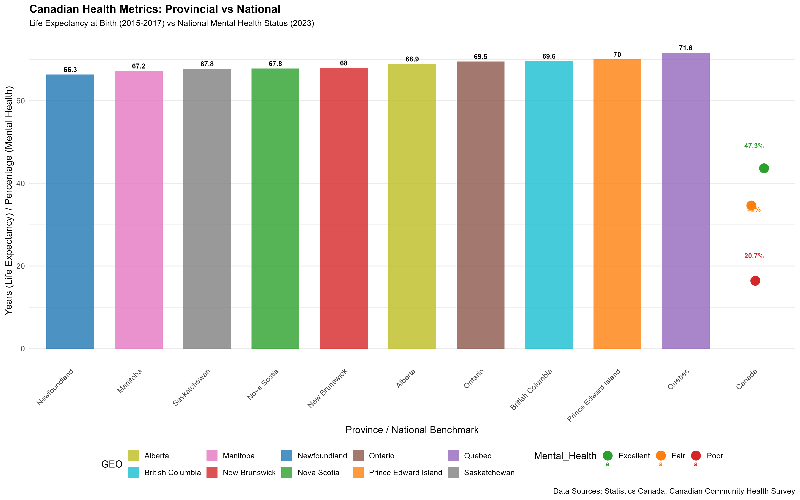

# 🌍 StatsCanada Insights: Exploring Health, Environment, and Social Trends in Canada 📊

**Visualizing Canada’s Well-being with R and ggplot2**

Welcome to **StatsCanada Insights**, a major data visualization project developed as part of my Business Analytics studies. This project focuses on three critical areas of Canadian life—**Health**, **Environment**, and **Social Connectedness**—using official datasets from **Statistics Canada**. With R and ggplot2, I’ve transformed raw data into meaningful visual narratives, culminating in an engaging infographic that summarizes key findings.

---

## 📌 About Me

I’m **Abhishek Kumar Yadav**, a Business Analytics graduate from Humber College, passionate about uncovering insights from complex datasets. This project showcases my hands-on skills in **data cleaning**, **exploratory analysis**, and **data storytelling** using R.

---

## 📑 Table of Contents

- [Project Overview](#project-overview)
- [Project Structure](#project-structure)
- [How to Run](#how-to-run)
- [Visualizations and Insights](#visualizations-and-insights)
  - [Health Domain 🩺](#1-health-domain-)
  - [Environment Domain 🌱](#2-environment-domain-)
  - [Social Connectedness Domain 🤝](#3-social-connectedness-domain-)
- [Data Sources](#data-sources)
- [Acknowledgments](#acknowledgments)
- [Contact](#contact)

---

## 📊 Project Overview

This project analyzes and visualizes Statistics Canada data in three thematic domains:

### 🩺 Health
- Life expectancy across provinces
- Mental health status trends
- Adherence to 24-hour movement guidelines

### 🌱 Environment
- Air quality index vs. Canadian standards
- National GHG emissions over time
- Water usage patterns in cubic meters

### 🤝 Social Connectedness
- Sense of belonging to local communities
- Availability of personal support networks
- Gender and province-wise comparisons

**Tools Used**: R, ggplot2, dplyr, tidyverse, patchwork, readr  
**Data Source**: Statistics Canada & Canadian Community Health Survey

---

## 📁 Project Structure
StatsCanadaAnalysis/
├── data/                         # Raw datasets from Statistics Canada
├── scripts/                      # R scripts for analysis & visualization
├── output/                       # Final plots and infographic
├── README.md                     # This file
├── .gitignore                    # Ignored files
└── StatsCanadaAnalysis.Rproj     # RStudio project file

## 🎨 Visualizations and Insights

### 1. Health Domain 🩺  
**Key Insight**: Quebec reports the highest life expectancy (71.6 years), while Newfoundland is the lowest (66.3 years).  
**Mental Health**: 20.7% of Canadians reported poor mental health in 2023.  
**Activity Trends**: Varying adherence to physical activity guidelines (2016–2021).  

📂 **Scripts**:  
- [`health.R`](scripts/health.R)  
- [`health 24 hours.R`](scripts/health%2024%20hours.R)  

🖼️ **Output**:  
-   
  [View Full Image](output/unified_health_analysis.png)

---

### 2. Environment Domain 🌱  
**Air Quality**: Improved from 63% (2005) to 85% (2019), but dropped to 74% in 2020.  
**GHG Emissions**: Peaked in 2007 at 774 Mt CO₂ eq; declined to 694 Mt by 2023.  
**Water Usage**: Consistent variations across provinces and years.  

📂 **Scripts**:  
- [`environment.R`](scripts/environment.R)  
- [`water usage.R`](scripts/water%20usage.R)

🖼️ **Output**:  
-   
  [View Full Image](output/environment_plot.png)  
-   
  [View Full Image](output/water_usage.png)

---

### 3. Social Connectedness Domain 🤝  
**Belonging**: Alberta scores highest (66.9%); Newfoundland lowest (51.9%).  
**Support Network**: British Columbia leads with 68.6% of people having someone to count on.  

📂 **Scripts**:  
- [`social.R`](scripts/social.R)  
- [`sense of belonging.R`](scripts/sense%20of%20belonging.R)

🖼️ **Output**:  
-   
  [View Full Image](output/social_connectedness_dot_plot.png)

---

## 📚 Data Sources

All datasets are publicly available from **Statistics Canada**:

### 🩺 Health
- [Life Expectancy (1310037001)](https://www150.statcan.gc.ca/t1/tbl1/en/tv.action?pid=1310037001)
- [Mental Health (4510008001)](https://www150.statcan.gc.ca/t1/tbl1/en/tv.action?pid=4510008001)
- [24-Hour Guidelines (1310082101)](https://www150.statcan.gc.ca/t1/tbl1/en/tv.action?pid=1310082101)

### 🌱 Environment
- [Air Quality Index (CAAQS)](https://www.canada.ca/en/environment-climate-change/services/environmental-indicators/air-quality-health-index.html)
- [GHG Emissions](https://www150.statcan.gc.ca/t1/tbl1/en/tv.action?pid=3810024901)
- [Water Usage (3810025001)](https://www150.statcan.gc.ca/t1/tbl1/en/tv.action?pid=3810025001)

### 🤝 Social Connectedness
- [Sense of Belonging (4510005201)](https://www150.statcan.gc.ca/t1/tbl1/en/tv.action?pid=4510005201)
- [Someone to Count On (4510005001)](https://www150.statcan.gc.ca/t1/tbl1/en/tv.action?pid=4510005001)
- [Belonging to Canada (4510007701)](https://www150.statcan.gc.ca/t1/tbl1/en/tv.action?pid=4510007701)

---

## 🙏 Acknowledgments  
- Data provided by **Statistics Canada** and the **Canadian Community Health Survey**  
- Visualizations created using R (`ggplot2`, `patchwork`, `readr`, etc.)

---

## 📬 Contact

**Abhishek Kumar Yadav**  
📧 abhishekyadav23122002@gmail.com  
📞 +1 226-201-0011  
🔗 [LinkedIn](https://www.linkedin.com/in/abhishekyadavab) | [GitHub](https://github.com/abhishekyadavab)
